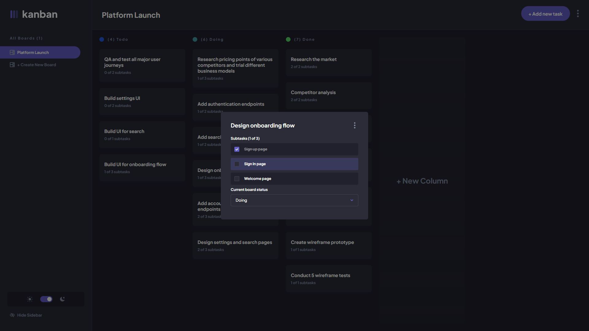

# Frontend Mentor - Kanban task management web app solution

This is a solution to the [Kanban task management web app challenge on Frontend Mentor](https://www.frontendmentor.io/challenges/kanban-task-management-web-app-wgQLt-HlbB). Frontend Mentor challenges help you improve your coding skills by building realistic projects.

## Table of contents

- [Overview](#overview)
  - [The challenge](#the-challenge)
  - [Screenshot](#screenshot)
- [My process](#my-process)
  - [Built with](#built-with)
  - [Continued development](#continued-development)
- [Author](#author)

## Overview

### The challenge

Users are able to:

- View the optimal layout for the app depending on their device's screen size
- See hover states for all interactive elements on the page
- Create, read, update, and delete boards and tasks
- Receive form validations when trying to create/edit boards and tasks
- Mark subtasks as complete and move tasks between columns
- Hide/show the board sidebar
- Toggle the theme between light/dark modes
- Keep track of any changes, even after refreshing the browser

### Screenshot

### Links

- Solution URL: [https://github.com/grzeg95/kanban-task-management-hosting](https://github.com/grzeg95/kanban-task-management-hosting)
- Live Site URL: [https://kanban.fm.grzeg.pl/](https://kanban.fm.grzeg.pl/)

## My process

### Built with

- Angular
- Firebase

### Continued development

- Allow users to drag and drop tasks to change their status and re-order them in a column

## Author

- Frontend Mentor - [@grzeg95](https://www.frontendmentor.io/profile/grzeg95)
